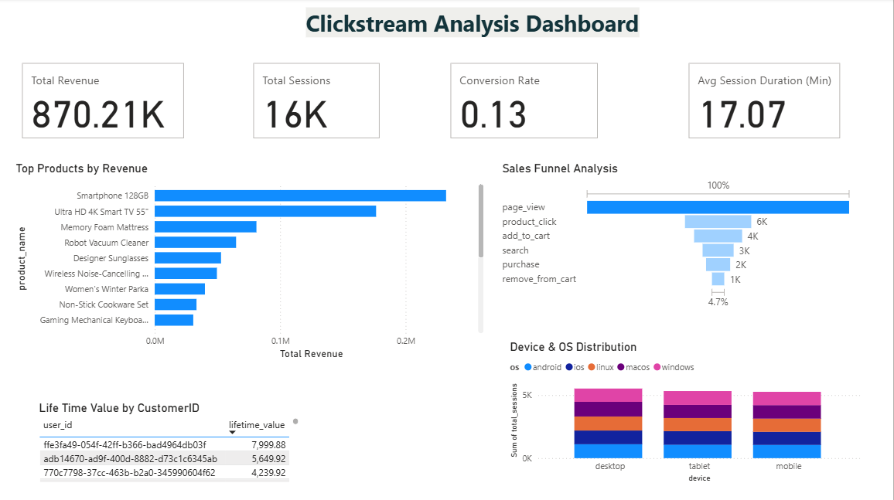

# Real-Time Clickstream Analytics Pipeline

This project demonstrates a complete, end-to-end data engineering pipeline that captures, processes, and analyzes real-time clickstream data from an e-commerce website. The entire infrastructure is built on a modern, cloud-native stack, leveraging **Confluent Cloud** for data ingestion, **Databricks** for scalable data transformation, and **Microsoft Power BI** for interactive business intelligence.

This repository contains the necessary scripts and configurations to build a system that can track user interactions, sessionize their activity, identify trending products, and calculate key business metrics like customer lifetime value—all in near real-time.

## ⭐ Project Highlights

* **Real-Time Data Ingestion:** A Python-based data producer simulates user clicks and sends them directly to a managed Apache Kafka cluster on **Confluent Cloud**.
* **Schema Enforcement:** Ensures data quality from the start using **Confluent Schema Registry** with JSON Schema.
* **Scalable Data Transformation:** The raw data is streamed from Kafka into **Databricks**, where PySpark jobs perform complex aggregations and transformations using the Medallion Architecture (Bronze, Silver, Gold layers).
* **Interactive Business Intelligence:** The final, cleaned data is loaded into **Google BigQuery**, which serves as a high-performance data warehouse for a **Power BI** dashboard.
* **Cloud-Native \& Fully Managed:** The entire pipeline relies on managed cloud services, minimizing operational overhead and maximizing scalability.

## 🏛️ Architecture Overview

The architecture is designed to be robust, scalable, and modular, following best practices for modern data platforms.

1. **Data Producer (`producer_with_env.py`):**
    * A Python script uses the `Faker` library to generate realistic e-commerce events (page views, clicks, purchases).
    * It connects to Confluent Cloud and uses a `JSONSerializer` to ensure every message conforms to a predefined schema.
    * Events are produced to a Kafka topic named `clickstream_event_v3`.
2. **Confluent Cloud (Managed Kafka):**
    * Acts as the central, scalable message broker for ingesting all incoming clickstream data.
    * The **Confluent BigQuery Sink Connector** is configured to automatically and continuously stream data from the Kafka topic into a raw "bronze" table in Google BigQuery.
3. **Google BigQuery (Data Warehouse):**
    * Serves as the data warehouse for all three layers of our Medallion Architecture.
    * **Bronze Layer:** Contains the raw, unaltered event data streamed from Confluent (`clickstream_event_v3` table).
    * **Silver \& Gold Layers:** These tables are created and managed by our Databricks jobs and contain cleaned, sessionized, and aggregated data.
4. **Databricks (Transformation Engine):**
    * This is the core of our data processing. A Databricks workspace is set up to run a scheduled PySpark job.
    * The job reads the raw data from the bronze BigQuery table, performs complex stateful transformations (like sessionization and windowed aggregations), and writes the results to the Silver and Gold tables in BigQuery.
5. **Power BI (Visualization \& Analytics):**
    * The final step of the pipeline. Power BI connects directly to the BigQuery tables.
    * It uses the clean, aggregated data from the Silver and Gold tables to create interactive dashboards for business users to explore KPIs, trends, and customer behavior.

